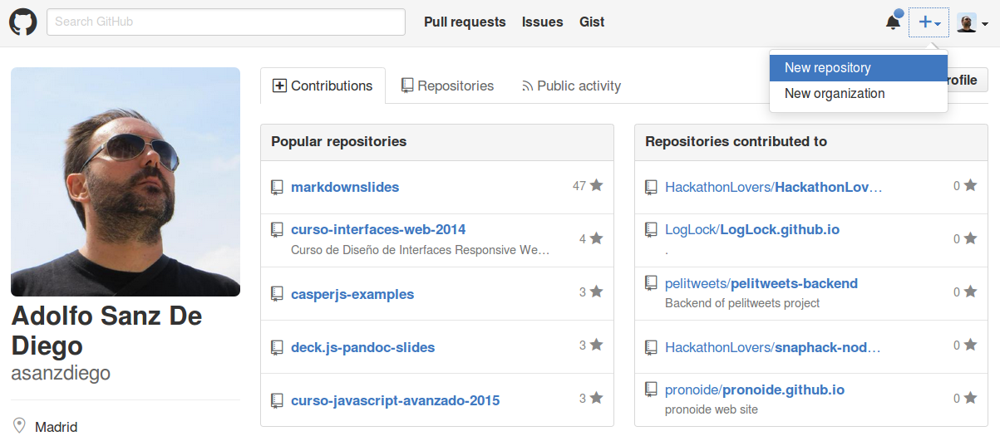

% Git, GitHub y Markdown
% Adolfo Sanz De Diego
% Octubre 2015

# Acerca de

## Autor

- **Adolfo Sanz De Diego**
    - Blog: [asanzdiego.blogspot.com.es](http://asanzdiego.blogspot.com.es/)
    - Correo: [asanzdiego@gmail.com](mailto:asanzdiego@gmail.com)
    - GitHub: [github.com/asanzdiego](http://github.com/asanzdiego)
    - Twitter: [twitter.com/asanzdiego](http://twitter.com/asanzdiego)
    - LinkedIn: [in/asanzdiego](http://www.linkedin.com/in/asanzdiego)
    - SlideShare: [slideshare.net/asanzdiego](http://www.slideshare.net/asanzdiego/)

## Licencia

- **Este obra está bajo una licencia:**
    - [Creative Commons Reconocimiento-CompartirIgual 3.0](http://creativecommons.org/licenses/by-sa/3.0/es/)

## Fuente

- Las slides y sus fuentes las podéis encontrar en:
    - <https://github.com/asanzdiego/curso-git-github-markdown-2015>

# Introducción

## Objetivos

1. Conocer las **características de Git** y ser capaz de instalar y configurarlo.
2. Conocer y ser capaz de usar los **comandos de Git**.
3. Conocer las **características de GitHub** y ser capaz de crear una cuenta y configurarla.
4. Ser capaz de **crear y clonar repositorios** en GitHub.
5. Conocer y ser capaz de **usar las principales características de GitHub**.
6. Conocer la **sintaxis del lenguaje Markdown**.

## Indice

- **Bloque 1**
    - Introducción a Git
    - Introducción a GitHub
    - Introducción Markdown
- **Bloque 2**
    - Uso básico de Git
    - Uso básico de GitHub
    - Sintaxis básica de Markdown
- **Bloque 3**
    - Uso avanzado de Git
    - Uso avanzado de GitHub
    - Sintaxis avanzada de Markdown

## Enlaces de interés

- Aprender GIT... y de camino GitHub:
    - <https://github.com/oslugr/curso-git>

- Página oficial de Git:
    - <https://git-scm.com/>

- Pro GIT:
    - <https://git-scm.com/book/es/v2>

- Minitutorial de GIT:
    - <https://try.github.io/>

- Página oficial de GitHub:
    - <https://github.com/>

- Chuleta de la sintaxis de Markdown:
    - <http://warpedvisions.org/projects/markdown-cheat-sheet>

# Introducción a Git

##  Sistema Control de Versiones

> "Sistema que registra los cambios realizados sobre un archivo o
conjunto de archivos a lo largo del tiempo, de modo que
puedas recuperar versiones específicas más adelante."

<https://git-scm.com/book/es/v1/Empezando-Acerca-del-control-de-versiones>

## VCS Locales

- **Lo más simple**: hacer copias de directorios.

- Aparecieron **BD en local** que guardan el registro de los cambios realizados a los archivos.

##  VCS Centralizados

- Un **servidor central** que guarda los cambios.

##  Pros y Contras VCS Centralizados

- **Pros**: más colaborativo que el local.

- **Contras**: dependes de un servidor central.

## VCS Distribuidos

- Cada cliente **no solo descarga la última copia, sino todo el repositorio**.

## Ventajes VCS Distribuidos

- Puedes seguir trabajando aunque el repositorio remoto esté caido.
    - **más autonomía**

- La información está más replicada.
    - **menos vulnerable**

- Permite pruebas en local y subir solo lo relevante.
    - **más limpieza**

##  Características de Git

- Creado por Linux Torvalds, líder del equipo del kernel Linux.

- Objetivos cuando se creó:
    - **Rápido**
    - **Sencillo**
    - **Multi rama**
    - **Distribuido**
    - **Grandes proyectos**

##  Instalación

- Windows: <https://git-scm.com/download/win>

- Mac: <https://git-scm.com/download/mac>

- Linux: <https://git-scm.com/download/linux>

## Configuración inicial

~~~
git config --global user.name "Nombre que quieras mostrar"
~~~

~~~
git config --global user.email "correo@electronico.es"
~~~

# Introducción a GitHub

##  Características de GitHub

- **Plataforma de desarrollo colaborativo**, que utiliza Git.

- Los **repositorios son públicos**, salvo con cuenta de pago.

- Tiene facetas de **red social** (perfil público, seguidores, estrellas, etc.)

- Nos permite **gestionar organizaciones y equipos**.

- **Gestión de proyectos** (wiki, releases, incidencias, gráficos, etc.)

- **Servidor web**.

##  Crear cuenta

##  Crear repositorio

# Introducción Markdown

##  Qué es Markdown

> "Es un lenguaje de marcado ligero que trata de conseguir la máxima
legibilidad y 'publicabilidad' usando texto plano."

<https://es.wikipedia.org/wiki/Markdown>

##  Características principales

- Texto plano
- Sintaxis sencilla
- Legibilidad
- Publicabilidad
- Exportabiliad

##  Editor online

- <https://jbt.github.io/markdown-editor/>

## Chuleta de Markdown:

- <http://warpedvisions.org/projects/markdown-cheat-sheet>

## Mardownslides

- <https://github.com/asanzdiego/markdownslides>

# Uso básico de Git

## init

- **Inicializar** un repositorio.

- Crea el subdirectorio .git con archivos de git par agestionar repositorio.

~~~
git init
~~~

## staging area

##  status

- Para saber el **estado** de los archivos.

~~~
git status
~~~

##  diff

- Para ver las **diferencias** entre el área de staging y el área de trabajo.

~~~
git diff
~~~

##  add

- Para **añadir** los cambios de un fichero (o varios) al área de staging (desde el área de trabajo).

~~~
git add nombre-del-fichero
~~~

~~~
git add *.extension
~~~

##  reset

- Para **resetear** los cambios de un fichero (o varios) al area de trabajo (desde el area de staging).

~~~
git reset nombre-del-fichero
~~~

##  commit

- Para **subir** los cambios realizados al repositorio (desde el área de staging).

~~~
git commit -m "mensaje corto descriptivo con los cambios"
~~~

##  checkout

- Para **deshacer** los cambios de un fichero (o varios) al area de staging (desde el repositorio).

~~~
git checkout nombre-del-fichero
~~~

## log

- Para ver el **listado de los commits** realizados en el repositorio.

~~~
git log
~~~

# Uso básico de GitHub

##  Configurar claves (I)

- Nos permite gestionar repositorios **mediante SSH** sin tener que estar poniendo
siempre nuestra constraseña.

- Se genera una **clave privada** que se guarde en nuestro ordenador y
una **clave pública** que es la que tenemos que guardar en nuestra cuenta.

##  Configurar claves (II)

- La podemos usar pues **solo con un ordenador**.

- Instrucciones:

    - <https://help.github.com/articles/generating-ssh-keys/>

##  Clonar repositorios

- Además de con git init, podemos empezar a trabajar con reposiorios clonandolos:

~~~
git clone git@github.com:asanzdiego/markdownslides.git
~~~

##  Uso social

- Seguir a gente.
- Seguir proyectos (watch).
- Premiar proyectos (start).
- Forquear proyectos (fork).
- Pull-requests.
- Issues.
- Crear organizaciones.

# Sintaxis básica de Markdown

##  Encabezados (I)

- `<h1>, <h2>, <h3>`

~~~
# Encabezado de primer nivel

## Encabezado de segundo nivel

### Encabezado de tercer nivel
~~~

##  Encabezados (II)

- Equivalente a lo anterior.

~~~
Encabezado de primer nivel
==========================

Encabezado de segundo nivel
---------------------------

### Encabezado de tercer nivel ###
~~~

##  Listas no numeradas

- No enumeradas:
    * se puede usar el asterísico
    - se puede usar el menos
    + se puede usar el más

~~~
* se puede usar el asterísico
- se puede usar el menos
+ se puede usar el más
~~~

##  Listas no numeradas

- Enumeradas:
    1. Primer elemento
    1. Segundo elemento
    1. Tercer elemento

~~~
1. Primer elemento
1. Segundo elemento
1. Tercer elemento
~~~

##  formato (negrita, cursiva, subrayado, tachado)

- Texto en cursiva con *un asterisco* o con _un guión bajo_.
- Texto en negrita con **dos asteriscos** o con __dos guiones bajos__.
- Texto ~~tachado~~.

~~~
- Texto en cursiva con *un asterisco* o con _un guión bajo_.
- Texto en negrita con **dos asteriscos** o con __dos guiones bajos__.
- Texto ~~tachado~~.
~~~

# Uso avanzado de Git

##  .gitignore, mv y rm

##  branch, checkout y merge

##  rebase, status y diff

# Uso avanzado de GitHub

##  gestionar equipos

##  pull-requests

##  git-pages

# Sintaxis avanzados de Markdown

## ids

##  tablas

##  bloques (citas, código)

##  enlaces e imágenes
